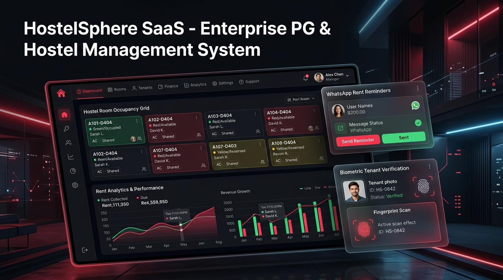

# 🏢 HostelSphere SaaS — Enterprise Hostel & PG Management System



[](https://reactjs.org/)
[](https://www.typescriptlang.org/)
[](https://vitejs.dev/)
[](https://tailwindcss.com/)
[](LICENSE)

**HostelSphere SaaS** is an enterprise-grade, commercial Hostel & Paying Guest (PG) Management System designed for hostel owners, facility managers, and tenants. It features single-owner Manager authentication, tenant portals, a 5-tier WhatsApp automated reminder engine, live room & bed matrix trackers, identity verification with live camera capture, automated PDF receipts, and multi-format data exports (Excel, CSV, PDF, JSON Backups).

---

## 🌟 Key Features

### 1. 📲 Smart WhatsApp Reminder Engine
- **Automated 5-Tier Due Categorization**:
  - `Rent Due in 2 Days`
  - `Rent Due Tomorrow`
  - `Rent Due Today`
  - `Overdue by 1–7 Days`
  - `Overdue > 7 Days`
- **1-Click Direct WhatsApp Dispatches**: Automatically formats personalized reminder templates with tenant name, rent amount, due date, and overdue days, and opens `wa.me` links pre-filled.
- **Instant Payment Synchronization**: Paid tenants are automatically removed from reminder queues across the application in real-time.

### 2. 🛏️ Interactive Room & Bed Management Grid
- Visual room matrix displaying real-time bed statuses (`Occupied` vs `Vacant`).
- Floor-wise filtering, room type categories (Single, Double Sharing, Triple Sharing), and monthly rent rate management.
- Live Empty Bed Tracker for rapid tenant allocation.

### 3. 🆔 Tenant Onboarding & Identity Security Vault
- Direct tenant account provisioning with temporary login passwords and mandatory first-login password updates.
- **Identity Document Proofs**: Aadhaar, PAN, Driving License, and Passport upload with masked ID numbers (`XXXX XXXX 9012`).
- **Live WebRTC Camera Capture**: Capture live resident identity photos directly during onboarding.
- **Police Verification Generator**: 1-click PDF export of official Police Verification forms pre-populated with tenant details.

### 4. 💰 Payment Ledger & UPI QR Gateway
- Automated **PDF Rent Receipt Generator** with unique receipt numbers (`REC-2026-XXXX`).
- **Instant UPI QR Code Generator**: Generates dynamic UPI QR codes (`upi://pay`) for 1-click scanning on PhonePe, GPay, Paytm, and BHIM UPI.
- Razorpay payment gateway integration architecture & late fee calculator.

### 5. 📊 Multi-Format Analytics & Data Exports
- Export Tenants Directory, Payment Ledger, and Occupancy Matrix to **Excel (`.xlsx`)**, **CSV**, and **PDF**.
- **JSON System Backup & Recovery**: 1-click export of complete database JSON backups with instant file restoration.

### 6. 🎨 Dark Mode & Global AI Command Palette
- Smooth **Dark & Light Mode Theme Toggle** with `localStorage` preference persistence and system theme auto-detection.
- **Global Search Palette (`Ctrl + K`)**: Instant search across tenants, mobile numbers, rooms, beds, receipt numbers, complaints, and visitor logs.

---

## 🚀 Tech Stack

- **Frontend**: React 18, TypeScript, Tailwind CSS, Lucide React Icons
- **Build Tool**: Vite 5 (Code-split with `React.lazy()` & `<Suspense>`)
- **State & Storage**: React Context API (`DataContext`, `AuthContext`, `ThemeContext`), LocalStorage Persistence
- **Export & PDF**: SheetJS (`xlsx`), `jspdf`, `html2canvas`
- **Media Capture**: WebRTC Navigator MediaDevices API

---

## 🛠️ Quick Start & Installation

### Prerequisites
- Node.js (v16.0 or higher)
- npm or yarn

### 1. Clone Repository
```bash
git clone https://github.com/your-username/hostelsphere-saas.git
cd hostelsphere-saas
```

### 2. Install Dependencies
```bash
npm install
```

### 3. Start Development Server
```bash
npm run dev
```
Open your browser and navigate to **`http://localhost:3000`**

### 4. Build for Production
```bash
npm run build
```

---

## 🔑 Demo Credentials for Testing

| Portal | Email | Password | Role & Permissions |
| :--- | :--- | :--- | :--- |
| **Manager Portal** | `vamsigandrothu@gmail.com` | `vamsigandu` | **Hostel Owner / Manager**: Full executive access to Dashboard, Rooms, Tenants, Payments, WhatsApp Engine, Reports, & Settings. |
| **Tenant Portal** | `tenant@hostelsphere.com` | `Tenant@1234` | **Resident Tenant**: Access to personal profile, room details, rent payment history, and ticket raising. |

---

## 📂 Project Structure

```
hostel-pg-management/
├── assets/
│   └── hostelsphere_cover.jpg # Cover Banner Image
├── src/
│   ├── components/
│   │   ├── common/           # Navbar, Sidebar, Layout, CommandPalette, QrPaymentModal, Toast
│   │   ├── manager/          # WhatsAppReminderCenter, TenantProvisionModal, RoomModal, PaymentModal
│   │   ├── tenant/           # TenantDashboard, TenantProfile, RaiseComplaintModal
│   │   └── ui/               # Button, Card, Table, Badge, Input, Select, Modal, Skeleton
│   ├── context/
│   │   ├── AuthContext.tsx   # Manager & Tenant authentication & RBAC guards
│   │   ├── DataContext.tsx   # Centralized data store, 5-tier WhatsApp buckets, occupancy & revenue stats
│   │   └── ThemeContext.tsx  # Dark & Light mode theme provider
│   ├── pages/
│   │   ├── manager/          # ManagerDashboard, RoomManagement, TenantManagement, PaymentManagement, ReportsPage
│   │   ├── tenant/           # TenantDashboard, TenantProfile
│   │   └── LoginPage.tsx     # Unified login portal
│   ├── services/
│   │   ├── api.ts            # LocalDataService persistence layer & JSON Backup/Restore
│   │   ├── pdfGenerator.ts   # PDF Receipt & Police Verification form generator
│   │   └── whatsappService.ts# WhatsApp Web link generator & template parser
│   ├── utils/
│   │   ├── exportUtils.ts    # Excel (.xlsx) & CSV export utilities
│   │   ├── formValidation.ts # Input sanitization & regex validators
│   │   └── formatters.ts     # Currency, date, and masked ID formatters
│   ├── App.tsx               # Code-split lazy routes & Suspense fallback
│   └── main.tsx
├── README.md
├── package.json
├── tailwind.config.js
├── tsconfig.json
└── vite.config.ts
```

---

## 📜 License

This project is licensed under the **MIT License**.
